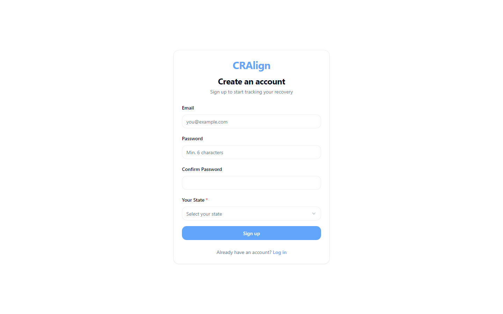

# CRAlign - AI Musculoskeletal Wellness Assessment

> AI-assisted musculoskeletal assessment producing structured findings and corrective exercise plans.

Built by **[Muhammad Tanveer](https://www.linkedin.com/in/muhammad-tanveer-advenno/)** - Full-Stack AI Automation Engineer.

 

## Contents

- [The problem](#the-problem)
- [The approach](#the-approach)
- [Architecture](#architecture)
- [Tech stack](#tech-stack)
- [Key capabilities](#key-capabilities)
- [Screenshots](#screenshots)
- [Results](#results)
- [FAQ](#faq)
- [Source code and access](#source-code-and-access)
- [About the engineer](#about-the-engineer)
- [Related projects](#related-projects)

## The problem

Musculoskeletal screening depends on practitioner availability and consistency. Two assessors can reach different conclusions from the same presentation, and clients rarely leave with a structured, followable plan.

## The approach

A guided assessment flow that captures inputs consistently, applies an analysis layer to produce structured findings, and turns those findings into a corrective exercise plan. Adapters keep the analysis layer independent of any single input source, so the assessment method can evolve without rewriting the application.

## Architecture

| Component | Responsibility |
| --- | --- |
| **Assessment flow** | Guided structured intake |
| **Analysis layer** | Findings generation from captured inputs |
| **Adapters** | Input-source abstraction keeping analysis portable |
| **Plan generator** | Corrective exercise programming from findings |

## Tech stack

| Layer | Technology |
| --- | --- |
| Frontend | TypeScript, Next.js |
| Analysis | AI-assisted assessment layer |
| Architecture | Adapter pattern for input sources |
| Docs | Worked examples and specifications |

## Key capabilities

- Guided musculoskeletal assessment
- Structured, repeatable findings
- Corrective exercise plan generation
- Adapter-based input abstraction

## Screenshots

## Results

- Consistent assessment output independent of individual assessor variation
- Clients leave with a structured plan rather than verbal advice

## FAQ

### Is this a medical device?

No. It is a wellness and screening tool that produces structured findings and exercise suggestions, not a diagnostic system.

### What does the AI actually do?

It turns captured assessment inputs into structured findings, applying the same logic every time so results do not vary by assessor.

### Why the adapter layer?

So the analysis stays independent of how inputs are captured and the assessment method can change without an application rewrite.

### Is the code public?

No - private repository, access on request.

## Source code and access

This repository is the public case study for **CRAlign - AI Musculoskeletal Wellness Assessment**. The full implementation - application code, database schema, tests and deployment configuration - lives in a **private repository** on this account, alongside the rest of the work shown here.

Source access can be arranged for hiring conversations, technical review or client due diligence. The quickest route is a short message on [LinkedIn](https://www.linkedin.com/in/muhammad-tanveer-advenno/) or an email to [mtanveertahir66@gmail.com](mailto:mtanveertahir66@gmail.com).

## About the engineer

**Muhammad Tanveer - Full-Stack AI Automation Engineer**

Full-stack AI automation engineer. I build agentic systems, browser and workflow automation, RAG pipelines and the production web platforms they run on - from Rust and Python services to Next.js dashboards and PHP/MySQL business systems.

- GitHub: [haddindeve](https://github.com/haddindeve)
- LinkedIn: [Muhammad Tanveer](https://www.linkedin.com/in/muhammad-tanveer-advenno/)
- Email: [mtanveertahir66@gmail.com](mailto:mtanveertahir66@gmail.com)
- Location: Pakistan

## Related projects

- [Hafiz Fabrics - Retail POS and ERP](https://github.com/haddindeve/hafiz-fabrics-pos-erp)
- [Advenno - Agency Platform with Client and Employee Portals](https://github.com/haddindeve/advenno-agency-saas-platform)
- [SMIP - Smart Manufacturing Intelligence Platform](https://github.com/haddindeve/smip-ai-iot-manufacturing-platform)
- [Offline-First Restaurant POS](https://github.com/haddindeve/restaurant-pos-offline-first)
- [ATM Electronic Journal Parser and GL Reconciliation](https://github.com/haddindeve/ej-rolls-atm-reconciliation)
- [AuthentID - eMRTD Chip Identity Verification](https://github.com/haddindeve/authentid-emrtd-face-verification)

---

CRAlign - AI Musculoskeletal Wellness Assessment - case study by Muhammad Tanveer - Full-Stack AI Automation Engineer. Keywords: musculoskeletal assessment software, AI posture analysis, corrective exercise platform, MSK wellness application, physiotherapy software, health assessment AI.